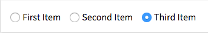

# Radios

Convenient way to create sets of radio buttons.



```jsx
import Radios from 'patchkit-radios'

const opts = [
  { label: 'First Item', value: 1 },
  { label: 'Second Item', value: 2 },
  { label: 'Third Item', value: 3, defaultChecked: true }
]
const onChange = opt => { console.log('selected', opt) }
<Radios className="radios-example" group="example" options={opts} onChange={onChange} />
```

The `group` attribute sets the name on the inputs.